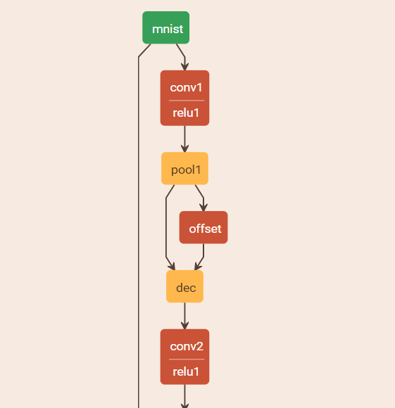

## Caffe implementation of Deformable Convolutional Networks
 * Thanks to offical code: https://github.com/msracver/Deformable-ConvNets
 
## faster rcnn(ResNe50) results:
coming soon
 
## Usage
### Use my  modified caffe 
The MNIST example is in caffe/defor/ 

Compile:
```
mkdir build
cd build
cmake ..
make  all
```

Train:
```
cd caffe/defor/
./train_lenet.sh
```
and the model is in caffe/defor/model_protxt/
### use faster rcnn
Train:
```
./experiments/scripts/faster_rcnn_end2end.sh  0 ResNet50  pascal_voc
```
test
```
./test.sh  0 ResNet50  pascal_voc
```

### Use the codes in your caffe
All codes are in deformable_conv_cxx/

#### 1. Add  layer definition to caffe.proto:

```
optional DeformableConvolutionParameter deformable_convolution_param = 999;
  
message DeformableConvolutionParameter {
  optional uint32 num_output = 1; 
  optional bool bias_term = 2 [default = true]; 
  repeated uint32 pad = 3; // The padding size; defaults to 0
  repeated uint32 kernel_size = 4; // The kernel size
  repeated uint32 stride = 6; // The stride; defaults to 1
  repeated uint32 dilation = 18; // The dilation; defaults to 1
  optional uint32 pad_h = 9 [default = 0]; // The padding height (2D only)
  optional uint32 pad_w = 10 [default = 0]; // The padding width (2D only)
  optional uint32 kernel_h = 11; // The kernel height (2D only)
  optional uint32 kernel_w = 12; // The kernel width (2D only)
  optional uint32 stride_h = 13; // The stride height (2D only)
  optional uint32 stride_w = 14; // The stride width (2D only)
  optional uint32 deformable_group = 5 [default = 4]; // The group size for group conv
  optional FillerParameter weight_filler = 7; // The filler for the weight
  optional FillerParameter bias_filler = 8; // The filler for the bias
  enum Engine {
    DEFAULT = 0;
    CAFFE = 1;
    CUDNN = 2;
  }
  optional Engine engine = 15 [default = DEFAULT];
  optional int32 axis = 16 [default = 1];
  optional bool force_nd_im2col = 17 [default = false];
}
```
you can read the template in deformable_conv_cxx/caffe.proto

#### 2.Move codes to  your caffe
```
move deformable_conv_layer.cpp and deformable_conv_layer.cu to yourcaffepath/src\caffe\layers\

move deformable_conv_layer.hpp to yourcaffepath/include\caffe\layers\

move deformable_conv_layer.hpp to yourcaffepath/include\caffe\layers\

move deformable_im2col.cu to yourcaffepath\src\caffe\util\

move deformable_im2col.hpp to yourcaffepath\include\caffe\util\
```
#### 3.Compile in your caffe root path
```
mkdir build
cd build
cmake ..
make  all
```
## About the deformable conv layer
The params in DeformableConvolution:
```
bottom[0](data): (batch_size, channel, height, width)
bottom[1] (offset): (batch_size, deformable_group * kernel[0] * kernel[1]*2, height, width)
```
Define:
```
f(x,k,p,s,d) = floor((x+2*p-d*(k-1)-1)/s)+1
```
the output of the DeformableConvolution layer:
```
out_height=f(height, kernel[0], pad[0], stride[0], dilate[0])
out_width=f(width, kernel[1], pad[1], stride[1], dilate[1])
```

Offset layer:
```
layer {
  name: "offset"
  type: "Convolution"
  bottom: "pool1"
  top: "offset"
  param {
    lr_mult: 1
  }
  param {
    lr_mult: 2
  }
  convolution_param {
    num_output: 72
    kernel_size: 3
    stride: 1
    dilation: 2
    pad: 2
    weight_filler {
      type: "xavier"
    }
    bias_filler {
      type: "constant"
    }
  }
}
```

DeformableConvolution layer:

```
layer {
  name: "dec"
  type: "DeformableConvolution"
  bottom: "conv1"
  bottom: "offset"
  top: "dec"
  param {
    lr_mult: 1
  }
  param {
    lr_mult: 2
  }
  deformable_convolution_param {
    num_output: 512
    kernel_size: 3
    stride: 1
    pad: 2
    engine: 1
    dilation: 2
    deformable_group: 4
    weight_filler {
      type: "xavier"
    }
    bias_filler {
      type: "constant"
    }
  }
}
```
the prototxt model should like:


  

The following animation is generated by Felix Lau (with his tensorflow implementation):https://github.com/felixlaumon/deform-conv/


### TODO List

 - [x] all tests passed
 - [x] evaluate performance on Regular MNIST
 - [ ] evaluate  object detection  performance on voc


 ## Deformable Convolutional Networks
> Dai, Jifeng, Haozhi Qi, Yuwen Xiong, Yi Li, Guodong Zhang, Han Hu, and Yichen
Wei. 2017. “Deformable Convolutional Networks.” arXiv [cs.CV]. arXiv.
http://arxiv.org/abs/1703.06211
